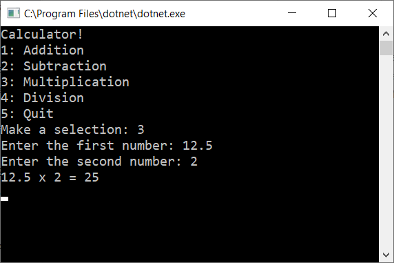
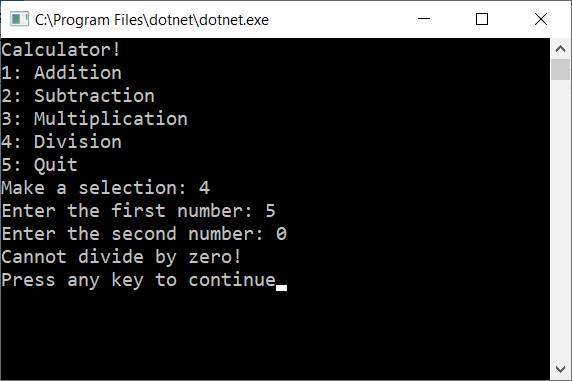

# Prework-Calculator
### Basic command line calculator

Choose a menu option, enter two numbers, and get the results on screen. 
Safeguards in place for accidental division by zero.

### Screenshots

